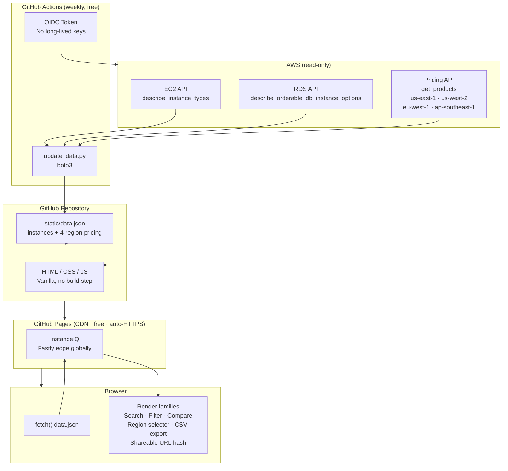

# Building InstanceIQ: A Zero-Backend AWS Instance Explorer with Live Pricing, Comparison, and Shareable Links

**Level 300 · by devopscaptain**

*Tags: AWS, EC2, RDS, GitHub Actions, GitHub Pages, boto3, Static Sites, DevOps Tooling*

---

## The Problem

Every AWS architect has been there: you open the EC2 instance types page, stare at 700+ rows, and try to remember whether `r6g` or `x2idn` is the right call for in-memory analytics. The questions engineers actually ask are:

- "What family should I be in for this workload?"
- "Is `m7g.4xlarge` cheaper than `m6a.4xlarge` for the same vCPU/RAM ratio?"
- "Which RDS class supports Aurora PostgreSQL and is under $0.40/hr in EU?"
- "My current instance is `c5.2xlarge` — what is the spec delta to `c6i.2xlarge`, and what do I save per month?"

I built **InstanceIQ** to answer all of these without opening five browser tabs, running CLI commands, or writing throwaway scripts.

---

## Goals and Constraints

Three hard constraints before writing a line of code:

1. **No backend.** No Lambda, no EC2, no container. Zero runtime infrastructure = zero operational cost.
2. **No credentials to view.** Every visitor sees the full site immediately. AWS credentials only appear in CI.
3. **No AI.** Instance suitability is published AWS knowledge — whitepapers, re:Invent talks, the Well-Architected Framework. Encoding it as structured JSON is more auditable and faster than a language model at runtime.

---

## The $0 Infrastructure Stack

The entire production infrastructure costs **exactly $0/month**.

| Service | What it does | Cost |
|---|---|---|
| **GitHub Pages** | Global CDN hosting with automatic HTTPS | **Free** |
| **GitHub Actions** | Weekly AWS data refresh (Python + boto3) | **Free** (2,000 min/month on free tier) |
| **GitHub repo** | Stores source code and `data.json` | **Free** |
| **AWS read-only APIs** | `describe_instance_types`, `describe_orderable_db_instance_options`, `get_products` | **Free** (read APIs carry no charge) |

No EC2. No Lambda. No S3. No CloudFront. No load balancer. Nothing to patch, rotate, or page you at 3am.

### GitHub Pages: The Real Story

GitHub Pages is not just "put your HTML somewhere." It is a full CDN-backed hosting platform built into every public GitHub repository:

- **Automatic HTTPS** — TLS cert provisioned and renewed by GitHub, zero configuration.
- **Global CDN via Fastly** — assets served from edge nodes worldwide. A Tokyo visitor gets the same sub-100ms load as a Virginia visitor.
- **Custom domains** — single CNAME record, GitHub handles the certificate.
- **Instant deploys from `git push`** — every push to `main` triggers a Pages rebuild in under 60 seconds, globally live.
- **Zero egress cost** — GitHub does not charge per-GB served. A popular tool costs the same as one with no traffic.

To enable: repository → **Settings → Pages → Deploy from branch → `main` → `/` root → Save**. That is the entire setup.

```
git push origin main
        │
        ▼  GitHub detects push (~5s)
        │
        ▼  Pages build triggered (~30s)
        │
        ▼  Fastly CDN cache invalidated globally
        │
        ▼  Live worldwide in under 60 seconds
```

### GitHub Actions: Free CI/CD for Your Data Pipeline

The weekly data refresh is a YAML file checked into the repo. The free tier gives every account **2,000 minutes/month**. Our weekly Python script takes 4–6 minutes per run:

```
52 runs/year × 5 minutes = 260 minutes/year
= ~10% of the free monthly allowance, used annually
```

```yaml
on:
  schedule:
    - cron: '0 0 * * 1'   # Every Monday midnight UTC
  workflow_dispatch:        # Also triggerable from the Actions tab
```

The workflow: checks out repo → assumes IAM role via OIDC → runs Python script → commits updated `data.json` → pushes to `main` → GitHub Pages auto-redeploys. **Fully automated. Zero cost. Zero ops.**

### Why Static Beats a Serverless API Here

| Concern | Lambda + API GW | Static + GitHub Pages |
|---|---|---|
| Latency | 50–200ms cold start + network | CDN edge, ~10ms |
| Cost | Per-invocation + API GW + CloudWatch | $0 |
| Ops | IAM, throttling, error rates, cold starts | Nothing |
| Data freshness | Real-time (AWS instance types change weekly at most) | Weekly — same effective freshness |
| Offline dev | Needs SAM/LocalStack | `python3 -m http.server 8080` |

For data that changes at most once a week, real-time API calls are pure overhead.

---

## Architecture Overview



The key insight: **the browser never calls AWS**. All API calls happen in CI once a week. The browser fetches one pre-built JSON file from a CDN edge node near it.

---

## The Data Pipeline

### Two-Layer data.json

The file has a deliberate split:

| Layer | Who writes it | What it contains |
|---|---|---|
| **Static** (`ec2Families`, `rdsFamilies`, `rdsEngines`) | Humans | Reasoning, icons, "best for" tags, use-case guidance |
| **Dynamic** (`ec2Instances`, `rdsInstances`, `ec2RegionalPrices`, `rdsRegionalPrices`) | CI weekly | Specs, instance counts, per-region pricing |

The CI script only overwrites the dynamic layer:

```python
for family in data.get('ec2Families', {}).keys():
    if family in ec2_instances_by_family:
        data['ec2Instances'][family] = ec2_instances_by_family[family]
```

The curated reasoning is never auto-overwritten. It is editorial content a human controls.

### Multi-Region Pricing

One of the most-requested features was regional pricing. AWS Pricing API lives only in `us-east-1` but covers all regions via the `location` filter:

```python
PRICING_REGIONS = {
    'us-east-1':      'US East (N. Virginia)',
    'us-west-2':      'US West (Oregon)',
    'eu-west-1':      'EU (Ireland)',
    'ap-southeast-1': 'Asia Pacific (Singapore)',
}

def get_ec2_prices(pricing_client, location='US East (N. Virginia)'):
    paginator = pricing_client.get_paginator('get_products')
    pages = paginator.paginate(
        ServiceCode='AmazonEC2',
        Filters=[
            {'Type': 'TERM_MATCH', 'Field': 'location',       'Value': location},
            {'Type': 'TERM_MATCH', 'Field': 'preInstalledSw', 'Value': 'NA'},
            {'Type': 'TERM_MATCH', 'Field': 'tenancy',        'Value': 'Shared'},
            {'Type': 'TERM_MATCH', 'Field': 'capacitystatus', 'Value': 'Used'},
        ]
    )
    # ... extract Linux and Windows OD prices
```

Prices are stored in a flat top-level map keyed by instance type and region, keeping per-instance records lean:

```json
{
  "ec2RegionalPrices": {
    "m7g.4xlarge": {
      "us-east-1":      { "linux": 0.6720, "windows": 1.0640 },
      "eu-west-1":      { "linux": 0.7680, "windows": 1.2160 },
      "ap-southeast-1": { "linux": 0.7840, "windows": 1.2800 }
    }
  }
}
```

The frontend resolves the active region at render time — no re-fetch needed:

```js
function getEc2LinuxPrice(instanceType) {
    const r = state.ec2RegionalPrices?.[instanceType]?.[state.activeRegion];
    if (r?.linux != null) return r.linux;
    return state.instanceLookup.get(`ec2:${instanceType}`)?.price_hourly ?? null;
}
```

When the user switches region, `renderEc2Families()` and `renderRdsFamilies()` re-run. Because all data is already in memory, this is instant — no network call, no spinner.

### IAM Permissions (Least Privilege + OIDC)

The GitHub Actions role needs exactly three AWS managed policies:

```
AmazonEC2ReadOnlyAccess
AmazonRDSReadOnlyAccess
AWSPriceListServiceFullAccess
```

No write access to EC2 or RDS. No IAM permissions. Using OIDC eliminates long-lived access keys entirely:

```json
{
  "Condition": {
    "StringEquals": {
      "token.actions.githubusercontent.com:aud": "sts.amazonaws.com",
      "token.actions.githubusercontent.com:sub": "repo:OWNER/REPO:ref:refs/heads/main"
    }
  }
}
```

The token is ephemeral, scoped to the specific repo and branch, and rotates automatically every run.

---

## Frontend Architecture

### State Management Without a Framework

All mutable state lives in one plain object with clearly typed fields. No reactive proxy, no store subscription — just a direct function call when something changes:

```js
const state = {
    activeTab:          'ec2',
    activeFilter:       'all',
    searchQuery:        '',
    activeRegion:       'us-east-1',
    ec2Data:            null,
    rdsData:            null,
    ec2RegionalPrices:  {},   // inst_type → { region → { linux, windows } }
    rdsRegionalPrices:  {},   // db_class  → { region → price }
    compareItems:       new Map(),   // ikey → { itype, label, data }
    instanceLookup:     new Map(),   // "ec2:t3.micro" → instance object
};
```

### Search: Cache at Render Time

A naive search reads `card.textContent` on every keystroke — expensive for 700+ DOM nodes. Instead, a `data-search-text` attribute is computed once at card render time and never touched again:

```js
const searchText = [
    familyName, category, headline, reasoning,
    ...bestFor, ...notFor,
    ...instances.map(i => i.instanceType || i.dbInstanceClass || ''),
].join(' ').toLowerCase();
// stored as: data-search-text="t3 general purpose burstable..."
```

Search then becomes a single `String.prototype.includes()` call per card. Debounced at 200ms.

### The Comparison Feature

**Identity keys:** each instance gets a namespaced string key (`ec2:t3.micro`, `rds:db.r6g.large`). This prevents collisions and makes type extraction trivial.

**O(1) lookup:** after data loads, all instances are indexed into a flat `Map`. The comparison modal never traverses the family hierarchy.

**Event delegation:** a single listener on the grid container handles all `+` button clicks — no per-row listener attachment, no memory leaks, works for rows rendered at any time.

**Best/worst highlighting:** one pass over numeric values per row finds min/max. `higherIsBetter: true` for vCPU/RAM, `false` for cost. Guard prevents highlighting when all values are equal.

### Shareable Comparison URLs

The comparison state is encoded in the URL hash so links are shareable without a server:

```
https://devopscaptain.github.io/AWS-Instance-Explorer/#compare=ec2%3Am7g.4xlarge%2Cec2%3Ac7g.4xlarge
```

On every selection change:

```js
function updateCompareHash() {
    const keys = [...state.compareItems.keys()];
    history.replaceState(null, '', '#compare=' + encodeURIComponent(keys.join(',')));
}
```

On page load, after the instance lookup is built:

```js
function parseCompareFromHash() {
    const hash = window.location.hash;
    if (!hash.startsWith('#compare=')) return;
    const keys = decodeURIComponent(hash.slice('#compare='.length)).split(',');
    for (const key of keys) {
        if (state.instanceLookup.has(key) && state.compareItems.size < MAX_COMPARE) {
            // pre-select and open comparison modal
        }
    }
}
```

No server-side session. No database. The entire state lives in a 100-byte URL fragment.

### Export to CSV

The comparison table is serialised to CSV entirely in the browser — no server upload, no third-party library:

```js
const blob = new Blob([csv], { type: 'text/csv' });
const url  = URL.createObjectURL(blob);
const a    = document.createElement('a');
a.href     = url;
a.download = `instanceiq-compare-${state.activeRegion}-${Date.now()}.csv`;
document.body.appendChild(a);
a.click();
document.body.removeChild(a);
URL.revokeObjectURL(url);
```

The exported filename includes the active region and a timestamp — `instanceiq-compare-eu-west-1-1741000000000.csv` — so downloaded files are self-identifying.

---

## Key Takeaways

**1. GitHub Pages + Actions is production infrastructure, not a toy.**
Free, globally distributed, HTTPS-by-default, zero ops. For any read-heavy tool that doesn't need real-time data, this stack is strictly better than self-hosting.

**2. Pre-compute at CI time. Serve at edge time.**
Fetching AWS pricing in a weekly CI job and embedding it in a static JSON file is faster and cheaper than calling the Pricing API per request — and the data is the same.

**3. Multi-region pricing without a backend.**
By fetching 4 regions in the CI script and storing a flat price map in `data.json`, the frontend does live region switching with zero network calls. The entire JSON including 4-region pricing stays under 800KB — one CDN round-trip.

**4. URL hash as your persistence layer.**
For shareable state in a static app, `window.location.hash` + `history.replaceState` gives you deep-linkable, bookmarkable, shareable state with no server, no database, and no cookies.

**5. OIDC for GitHub Actions is table-stakes.**
If you are still using long-lived IAM access keys in GitHub Secrets, migrate to OIDC. One-time 15-minute setup, eliminates an entire class of credential exposure risk, tokens auto-rotate every run.

**6. Separate dynamic data from curated content in your JSON.**
The two-layer `data.json` pattern keeps automated CI updates safe — the script can never overwrite editorial reasoning, icons, or guidance that a human wrote.

---

## What's Next

- **Savings Plans / Reserved pricing** columns in the comparison table
- **More regions** — currently 4; expanding to full AWS region list
- **Instance generation upgrade paths** — highlight the direct successor of a selected instance

---

*InstanceIQ is open source on GitHub. The full CI workflow, Python data pipeline, and frontend source are in the repo. Contributions welcome.*
