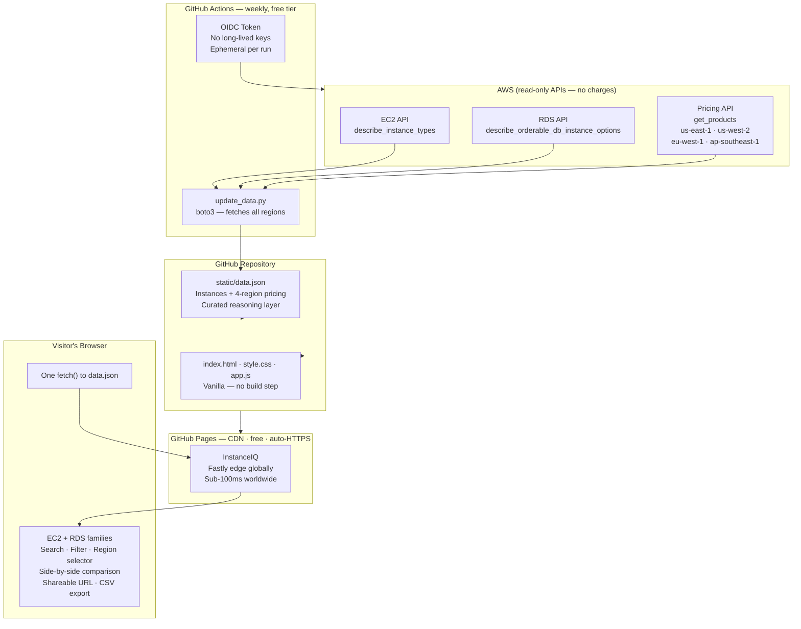

# Building InstanceIQ: A Fully Free AWS Instance Explorer with Live Pricing, Comparison, and Shareable Links

**Level 300 · by devopscaptain**

*Tags: AWS, EC2, RDS, GitHub Actions, GitHub Pages, Static Sites, DevOps Tooling*

---

## Why I Built This

Every AWS architect has been there. You're in the middle of a sizing conversation, someone asks "should we go with `r6g` or `x2idn` for this in-memory workload?" and you end up with five browser tabs open — the AWS pricing calculator, the EC2 instance types page, the RDS docs, a Stack Overflow thread from 2021, and a spreadsheet someone on the team made two years ago that may or may not be accurate anymore.

The real questions engineers ask don't fit neatly into AWS documentation:

- "What family should I even be in for this workload?"
- "Is `m7g.4xlarge` actually cheaper than `m6a.4xlarge` for the same vCPU/RAM ratio?"
- "Which RDS class supports Aurora PostgreSQL and costs under $0.40/hr in EU Ireland?"
- "My current instance is `c5.2xlarge` — what's the spec delta to `c6i.2xlarge`, and what do I save per month?"

**InstanceIQ** is my answer to all of those. One page. All EC2 and RDS instance families. Per-family workload guidance. Live on-demand pricing across four regions. Side-by-side instance comparison with a shareable link. And it runs entirely for free — no backend, no AWS credentials to view it, no infrastructure to maintain.

---

## The $0 Stack

Before anything else — let's talk about cost. The entire production infrastructure for InstanceIQ costs **exactly $0/month**. Not "cheap." Zero.

| What | Does | Costs |
|---|---|---|
| **GitHub Pages** | Hosts and serves the site globally via CDN | **Free** |
| **GitHub Actions** | Runs the weekly AWS data refresh | **Free** (2,000 min/month on free tier) |
| **GitHub Repository** | Stores all code and the pre-built data file | **Free** |
| **AWS Pricing/EC2/RDS APIs** | Read-only, queried from CI once a week | **Free** (read calls carry no charge) |

No EC2. No Lambda. No S3 bucket. No CloudFront distribution. No RDS. No load balancer. No container registry. No monitoring agent. Nothing to patch, nothing to rotate, nothing that pages you at 3am.

### GitHub Pages Is More Than Static Hosting

Most people think of GitHub Pages as "a place to put your portfolio." It is actually a production-grade, globally distributed CDN platform that happens to be built into every public GitHub repository.

When you push to `main`, GitHub triggers a build, invalidates the Fastly CDN cache, and your site is live worldwide in under 60 seconds. You get automatic HTTPS with cert renewal managed by GitHub. You get custom domain support with a single CNAME. You get zero egress charges — a tool that goes viral costs the same as one with no traffic. And you get none of the operational overhead of running a web server.

The setup is literally three clicks: **Settings → Pages → Deploy from branch → main → Save**. That is the entire deployment pipeline for a globally available, HTTPS-secured, CDN-backed web application.

### GitHub Actions Does the Heavy Lifting for Free

The weekly data refresh — calling AWS APIs, building the JSON file, committing it back to the repo — runs as a GitHub Actions workflow. The free tier gives every account 2,000 minutes per month. Our script takes about 5 minutes per run. Running weekly, that is roughly 260 minutes per year — about 10% of the free monthly allowance, used annually.

What does the workflow actually do? It checks out the repo, assumes an AWS IAM role using OIDC (no stored credentials — more on that shortly), runs a Python script that calls EC2, RDS, and the AWS Pricing API across four regions, writes an updated `data.json` file, commits it, and pushes back to main. GitHub Pages picks up the push and deploys automatically. The entire feedback loop — from AWS API call to live updated website — is fully automated and costs nothing.

### Why Not Just Build a Real API?

The instinct for a tool like this is to put a Lambda behind API Gateway, call AWS on demand, and return fresh pricing on every request. But think through what that actually buys you: AWS instance types are updated at most a handful of times per year. Pricing changes weekly at most. A real-time API would be calling the same data, every request, and charging you Lambda invocations, API Gateway requests, and CloudWatch logs to do it.

A static JSON file pre-built by CI and served from a CDN edge node near the visitor is strictly faster (no cold starts, no Lambda latency), strictly cheaper ($0), and has equivalent data freshness for this use case. The "serverless" version of this tool would cost more, respond slower, and require an on-call rotation for a dataset that changes once a week.

---

## Architecture: How It All Fits Together



The most important thing in this diagram: **the browser never calls AWS**. All API calls happen in CI, once a week. The browser fetches one pre-built JSON file from the nearest Fastly edge node and renders everything from that. No CORS issues. No rate limits. No AWS credentials exposed to visitors.

---

## The Data: Two Layers With Different Owners

`data.json` has a deliberate two-layer structure that makes the weekly CI refresh safe to run automatically.

The **static layer** — family reasoning, workload guidance, "Best For / Not Ideal For" tags, icons, category labels — is written and maintained by a human. The CI script never touches it. It is editorial content.

The **dynamic layer** — instance types, vCPU counts, memory sizes, network performance, and per-region pricing — is completely overwritten by the CI script on every run. If AWS launches a new instance size on Monday, it appears in the site by Monday night.

This separation means you can run the CI job confidently without worrying that automation will corrupt carefully written guidance. The human-owned content is structurally isolated from the machine-owned data.

### Multi-Region Pricing

One of the most-requested capabilities was regional pricing. The AWS Pricing API lives in `us-east-1` but covers all regions via a location filter. The CI script now queries four regions — US East, US West, EU Ireland, and AP Singapore — in a single workflow run and stores the results in a flat lookup map in `data.json`.

Why a flat map rather than embedding prices inside each instance record? Because instance specs (vCPU, memory, network) are the same regardless of region — only pricing varies. Keeping them separate avoids duplicating spec data four times and makes the per-region price lookup a simple two-level key access. The resulting JSON is compact: the entire file including 4-region pricing for 700+ EC2 instance types stays under 800KB — one CDN round-trip for any visitor.

When the user switches regions in the UI, the frontend resolves prices from the in-memory map instantly. No network call. No spinner. No re-render flash. All 700+ tables update in milliseconds because the data was already there.

---

## The Comparison Feature: Design Decisions

The comparison feature was the most architecturally interesting piece to build. The requirements sound simple — "let me compare a few instances" — but the details expose a lot of design choices.

### Selecting Instances Across the Entire Page

The first challenge is that instances live inside collapsible family cards spread across a scrolling page. You might want to compare `t3.micro` from the T family card at the top of the page with `m7g.xlarge` from a different card halfway down, then add `c7g.xlarge` from the Compute Optimized section. The selection state has to be global and persistent while you scroll around.

The solution is a flat `Map` in the application state — `compareItems` — keyed by a namespaced string identifier. Every EC2 instance gets a key like `ec2:t3.micro`. Every RDS class gets `rds:db.r6g.large`. The colon prefix prevents collisions between EC2 and RDS types and makes the type trivially extractable without any additional metadata.

When you click the `+` button on a row, the key is added to the map. Click again and it's removed. The button state across the entire page updates immediately via a single pass through all rendered `+` buttons — no event bubbling complexity, just a DOM query and a class toggle.

### The Sticky Tray

Once you've selected instances, you need to see what you've picked without scrolling back through the page. A sticky tray at the bottom of the viewport solves this. It slides up from below as soon as your first selection is made and stays visible as you scroll.

The tray shows named slots for each selected instance — so you can see at a glance what you've got — along with individual remove buttons and a global clear. It also shows the "Compare" button, which is disabled until you have at least two selections. There's a slot layout that always shows four positions (filling empties with dashed outlines) so you can see how many more you can add.

The tray also hosts the **Copy link** button. Clicking it encodes your current selection into the URL hash and copies it to clipboard. Any colleague you send that link to will land on the page with your exact comparison pre-loaded and the modal open. Zero server involvement.

### The Comparison Modal

The comparison modal shows specs side-by-side in a structured table. The design decisions here:

**Best/worst highlighting** is applied per row, not globally. For vCPUs and memory, the highest value is highlighted green. For cost, the lowest value is highlighted green. A guard prevents both cells from being highlighted when all values are equal — which would be misleading.

**Mixed EC2 + RDS selections** are handled gracefully rather than rejected. You can add both EC2 instances and RDS classes to a comparison, and the modal renders two separate tables — one for each type — with a notice explaining the split. The use case is real: a team evaluating whether to self-manage a database on EC2 versus using RDS might want to compare an EC2 instance against an RDS class directly.

**Region awareness** flows through the comparison table automatically. If you switch to EU Ireland before opening the modal, all prices shown are EU Ireland prices. If you switch region while the modal is open, the table refreshes in place — no need to close and reopen.

---

## Shareable Comparison Links: URL Hash as Your Database

Most "share this state" features require a server. You generate a short code, store the state server-side, and give the user a URL that decodes on the server at render time. That is an entire backend feature — a database table, a key generation function, a lookup endpoint, expiry logic.

InstanceIQ does the same thing with no server at all, using the URL hash.

The URL hash (`window.location.hash`) is the part of the URL after the `#`. Critically, the browser does not send the hash to the server — it is purely client-side. Which means you can store arbitrary state in it without any server knowing about it, and it is part of the URL that gets copied when someone shares a link.

When you add or remove instances from your comparison, the app encodes the selection as a comma-separated list of instance keys and writes it to the hash:

```
https://devopscaptain.github.io/AWS-Instance-Explorer/#compare=ec2%3Am7g.4xlarge%2Cec2%3Ac7g.4xlarge
```

When anyone visits that URL, the app loads normally, builds its data structures, then reads the hash, finds the instances, pre-selects them, and opens the comparison modal automatically. The visitor sees exactly what the sender saw.

The entire persistence layer is a 100-byte URL fragment. No database. No server. No session. No expiry date. Links work forever as long as the instances themselves still exist in `data.json`.

---

## Export to CSV: Send It to the Spreadsheet People

Not everyone lives in a web app. Finance teams, procurement, capacity planners — they work in spreadsheets. The CSV export button in the comparison modal generates a properly formatted CSV from the current comparison table, including the active region, and triggers a browser download.

Everything happens in the browser. No upload to a server, no third-party library, no dependencies. The generated filename includes the active region and a timestamp (`instanceiq-compare-eu-west-1-1741000000000.csv`) so downloaded files are self-identifying when they land in a shared folder two weeks later.

The region is embedded in the data itself too — each price column is labelled with the region code, so a spreadsheet opened months later is unambiguous about which region the pricing reflects.

---

## Security: No Credentials, No Keys, No Secrets

Visitors never need an AWS account. The site is a static file. There is nothing to authenticate against.

The only credentials in the system are the ones the GitHub Actions workflow uses to call AWS. And those are not stored credentials — they are ephemeral tokens issued by AWS's OIDC integration with GitHub.

Here is how it works: AWS trusts GitHub's OIDC identity provider. When the Actions workflow runs, GitHub issues a short-lived token that identifies the specific repository and branch. The workflow presents this token to AWS in exchange for temporary IAM credentials. Those credentials are scoped to read-only access (EC2, RDS, and Pricing APIs), are valid for the duration of the workflow run, and are never stored anywhere. There is no `AWS_ACCESS_KEY_ID` secret sitting in the repository settings waiting to be leaked.

The IAM role has exactly three managed policies attached:
- `AmazonEC2ReadOnlyAccess`
- `AmazonRDSReadOnlyAccess`
- `AWSPriceListServiceFullAccess`

No write access. No IAM permissions. No ability to create or delete anything. The workflow's only write action is a `git push` back to the repository — over HTTPS using the `GITHUB_TOKEN` that GitHub provides automatically, which is scoped to the repository and expires when the run ends.

---

## What I Learned

**Run your CI close to where the data lives, not where the users are.** The AWS Pricing API is in `us-east-1`. The CI runs there. The output is a file that gets served from CDN edges near each user. This is the right topology for a read-heavy, infrequently updated dataset.

**The URL hash is an underused primitive.** It gives you bookmarkable, shareable, serverless state persistence with no infrastructure. For tools where state is a selection or filter, not sensitive data, it is almost always the right answer.

**Separate human-owned content from machine-owned data in the same file.** The two-layer `data.json` design lets CI run safely and automatically without ever risking corruption of curated content. When you have mixed editorial and programmatic data, make the boundary explicit in the structure.

**GitHub Pages + Actions is not a toy stack.** It is a globally distributed, HTTPS-by-default, zero-ops hosting platform with a built-in CI/CD system. For tools that serve read-heavy, mostly-static content to developers and ops teams, it is often the most robust and cost-effective choice available — including compared to paid hosting platforms.

**OIDC for GitHub Actions should be your default, not your stretch goal.** Long-lived IAM access keys in repository secrets are a liability. OIDC eliminates them entirely, takes about 15 minutes to set up, and requires no rotation, no auditing of who has access to what secret, and no incident response playbook for leaked keys.

---

## What's Next

- **More regions** — currently four; expanding coverage to all commercial AWS regions
- **Savings Plans / Reserved pricing** columns alongside On-Demand in the comparison table
- **Instance generation upgrade paths** — highlight the direct current-gen successor of a selected previous-gen instance

---

*InstanceIQ is open source. Source code, the full GitHub Actions workflow, and the Python data pipeline are all in the repository. Contributions welcome.*
